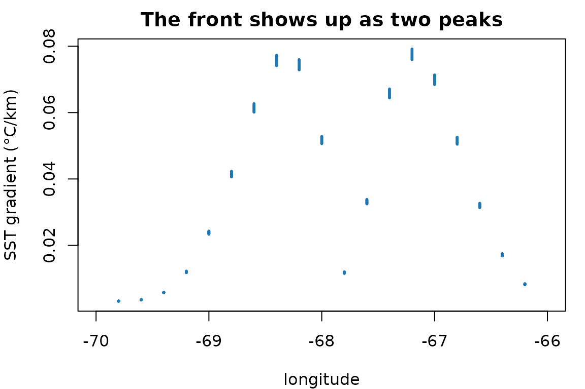

# Deriving covariates from gridded ocean data

An ocean model gives you temperature, salinity, and currents. What
concentrates plankton is usually not those values but how they are
*arranged* and how they are *changing*: a front rather than a
temperature, food accumulated since spring rather than food present
today. This package computes that second kind of quantity.

Everything here is real output. The vignette builds a small synthetic
field so the examples run without a Copernicus account, and every number
and figure below was produced by the code shown.

## The shape

Every function takes and returns the same thing: an `sf` POINT object
with one row per grid point and time step, a column per covariate, and
`YEAR`, `MONTH`, `DAY` columns. That is what every `datamatch` access
function returns, whichever of its seven sources it read, so nothing
below is tied to a particular product.

``` r

env <- datamatch::accessCopernicus(
  vars = c("SST", "SSS", "CHL"), years = 2010, months = 1:6,
  bounding_box = list(xmin = -70, xmax = -66, ymin = 41, ymax = 44)
)
```

Because input and output shapes are identical, the functions compose in
a pipe and nothing has to be reassembled.

For this vignette we build the same shape by hand: a temperature field
with a warm tongue that drifts west through the spring, on a small grid.

``` r

lon <- seq(-70, -66, by = 0.2)
lat <- seq(41, 44, by = 0.2)

frames <- lapply(1:6, function(month) {
  grid <- expand.grid(x = lon, y = lat)
  # A warm tongue centred at a longitude that moves west as the season goes on
  centre <- -67.5 - 0.25 * month
  grid$SST <- 8 + 6 * exp(-((grid$x - centre)^2) / 0.6) + 0.35 * (grid$y - 41)
  grid$CHL <- 0.4 + 0.25 * month
  # Fresher inshore, as a coastal current would leave it.
  grid$SSS <- 31 + 0.9 * (grid$x + 70) / 4
  grid$YEAR <- 2010
  grid$MONTH <- month
  grid$DAY <- 1L
  grid
})

env <- sf::st_as_sf(do.call(rbind, frames), coords = c("x", "y"), crs = 4326)
dim(env)
#> [1] 2016    7
```

## Gradients

[`horizontal_gradient()`](https://camilleross.org/derivoce/reference/horizontal_gradient.md)
gives the rate of change with distance, which is what picks out fronts.

``` r

env <- horizontal_gradient(env, "SST")
round(range(env$SST_grad, na.rm = TRUE), 3)
#> [1] 0.003 0.079
```

The units are **covariate units per kilometre**, not per degree. That is
the whole design. A degree of longitude is about 83 km at 42°N and 111
km at the equator, so a per-degree gradient is stretched by latitude and
not comparable across a study area. Boundary cells are `NA`, because a
central difference needs a neighbour on both sides.



Two peaks, because the tongue is warm in the middle: the gradient is
steep on both flanks and flat at the crest. A gradient finds edges, not
values.

## Lags and accumulation

Populations respond with a delay, and a survey samples the food built up
since the season began rather than the food present that instant.

``` r

env <- lag_covariate(env, "SST", n = 1, by = "month")
env <- integrate_covariate(env, "CHL", window = "year")

first_cell <- env[!duplicated(paste(env$MONTH)), ]
data.frame(
  month = first_cell$MONTH,
  CHL = round(first_cell$CHL, 2),
  CHL_int = round(first_cell$CHL_int, 2)
)
#>   month  CHL CHL_int
#> 1     1 0.65    0.65
#> 2     2 0.90    1.55
#> 3     3 1.15    2.70
#> 4     4 1.40    4.10
#> 5     5 1.65    5.75
#> 6     6 1.90    7.65
```

`CHL_int` is the running sum from January, which is what a copepod
integrates.

Note `by = "month"`. Counting *steps* is only unambiguous when the
series is complete: in a monthly record missing April, a one-step lag
makes March the predecessor of May and says nothing about it. Counting
calendar months returns `NA` there instead.

``` r

gappy <- env[env$MONTH != 4, ]

by_step <- lag_covariate(gappy, "SST", n = 1, by = "step")
by_month <- lag_covariate(gappy, "SST", n = 1, by = "month")

c(step = mean(is.na(by_step$SST_lag1)),
  month = mean(is.na(by_month$SST_lag1month)))
#>  step month 
#>   0.2   0.4
```

The calendar version has more `NA` because May genuinely has no April to
look back to. That is the honest answer.

A vector of lags builds an autoregressive set in one call:

``` r

env <- lag_covariate(env, "SST", n = 1:3, by = "year")
# adds SST_lag1year, SST_lag2year, SST_lag3year
```

[`rolling_covariate()`](https://camilleross.org/derivoce/reference/rolling_covariate.md)
describes the window instead of accumulating it. The mean of the last
three months and the variability of the last three months are different
covariates, and neither is their sum.

``` r

env <- rolling_covariate(env, "SST", n = 3, by = "month",
                         stat = c("mean", "sd"))
round(c(mean = mean(env$SST_mean3month, na.rm = TRUE),
        sd = mean(env$SST_sd3month, na.rm = TRUE)), 3)
#>   mean     sd 
#> 10.482  0.663
```

The window is trailing and inclusive, so March covers January to March.
Early steps have less history than the window asks for; `min_obs`
decides whether they get a summary of what is there or an `NA`.

`by = "month"` counts calendar time and `by = "step"` counts positions
in the record. They agree exactly until the series has a gap, and then
diverge silently — which is why the distinction is an argument rather
than an assumption.

## Distance to a front

The local gradient is a blunt predictor of frontal influence. A station
in a smooth patch has zero gradient whether the nearest front is 2 km
away or 200 km away, and those are very different places to be.

``` r

env <- distance_to_front(env, "SST", quantile = 0.9)
round(summary(env$SST_front_dist), 1)
#>    Min. 1st Qu.  Median    Mean 3rd Qu.    Max. 
#>     0.0    27.4    49.3    62.2    96.7   202.5
```

`scope` decides what “a front” means. The default takes one threshold
across the whole record, so a front means the same physical sharpness
every month and a quiet month may contain none. That is a real result
rather than something to suppress: a step with no front returns `NA`,
not `0`, because reporting zero would assert “you are standing on a
front”.

Fronts also move, and a distance measured at one moment cannot tell a
permanent feature from a passing one.
[`front_frequency()`](https://camilleross.org/derivoce/reference/front_frequency.md)
asks how *often* a place is frontal.

``` r

env <- front_frequency(env, "SST", scope = "step")
round(summary(env$SST_front_freq), 2)
#>    Min. 1st Qu.  Median    Mean 3rd Qu.    Max.     NAs 
#>    0.00    0.00    0.17    0.10    0.17    0.33     420
```

Here the warm tongue drifts west all season, so no cell is frontal for
long and the frequencies stay low. On a real domain the shelf break
stands out precisely because it does not move: a cell frontal in fifteen
steps of twenty sits on something a predator can learn, and one frontal
in one caught a filament going past.

## Anomalies and extremes

Eight degrees is cold for the southern Gulf of Maine and warm for the
Scotian Shelf. A model given raw temperature has to learn that geography
before it can use the departure from it, and
[`cell_anomaly()`](https://camilleross.org/derivoce/reference/cell_anomaly.md)
hands the departure over directly.

``` r

env <- cell_anomaly(env, "SST", reference = "record")
round(range(env$SST_anom), 2)
#> [1] -2.94  3.18
```

`reference = "record"` removes each cell’s whole-series mean, which
leaves the seasonal cycle in. `"climatology"` removes a mean per
calendar month instead, which is usually what you want — but it needs
several years, because with one year there is a single January per cell
and **every anomaly comes out exactly zero**. That is a silent failure,
so the function warns rather than handing back a plausible-looking
column of zeroes.

[`decompose_covariate()`](https://camilleross.org/derivoce/reference/decompose_covariate.md)
goes further and hands back the parts themselves, so each can be used or
inspected rather than only the leftover. Six months is too short for a
seasonal cycle, so ask for the trend alone.

``` r

env <- decompose_covariate(env, "SST", components = c("trend", "slope"))
round(range(env$SST_slope), 2)
#> [1] -14.43  14.63
```

That is the rate of change per year in each cell — here large, because
the warm tongue is sweeping west across the domain over a single season,
and every cell sees a steep local trend as it passes.

The trend and the seasonal cycle are fitted **together** rather than one
after the other. Taken in sequence each absorbs part of the other:
removing the trend first lets the seasonal cycle leak into it, because
months are of unequal length and a twelve-month cycle is not orthogonal
to a straight line in elapsed days. Fitted jointly, neither can steal
from the other.

`cell_anomaly(detrend = TRUE)` uses the same fit to give the departure
once both the seasonal cycle and the long-term change are gone.

[`marine_heatwave()`](https://camilleross.org/derivoce/reference/marine_heatwave.md)
needs the same history, for the same reason: a threshold taken over
three values is the largest of the three. Twelve years of one month is
enough to show it.

``` r

years <- 2000:2011
hw <- do.call(rbind, lapply(years, function(y) {
  data.frame(x = -68, y = 43, YEAR = y, MONTH = 1L, DAY = 1L,
             # An ordinary decade, then one very warm year.
             SST = 9 + 0.4 * ((y * 7) %% 5) + if (y == 2011) 6 else 0)
}))
hw <- sf::st_as_sf(hw, coords = c("x", "y"), crs = 4326)

hw <- marine_heatwave(hw, "SST", min_steps = 1)
sf::st_drop_geometry(hw)[hw$mhw_event,
                         c("YEAR", "mhw_intensity", "mhw_category")]
#>    YEAR mhw_intensity mhw_category
#> 12 2011      5.566667            4
```

One event, in the year it was built into. Intensity is measured from the
climatology rather than from the threshold, so it is comparable between
cells whose thresholds differ, and the category counts how many
multiples of the threshold’s own excess the value reached.

## Density

Temperature is a poor stand-in for density wherever salinity varies, and
the Gulf of Maine is such a place: Scotian Shelf inflow arrives cold
*and* fresh, and the two pull density in opposite directions.

``` r

env <- potential_density(env)
round(range(env$sigma_theta), 2)
#> [1] 23.05 24.84
```

That is sigma-theta, density minus 1000, from the UNESCO (1983) equation
of state. Salinity given as a mass fraction rather than PSU sits inside
the fitted range and would return a plausible freshwater density, so a
column entirely below 1 PSU is called out separately.

## Stratification and where eddies are made

`accessCopernicus()` takes a `depth` argument and returns one level per
call, so a second fetch at a deeper level gives you the other half of a
vertical difference. Here we stand one in for a second fetch: colder,
saltier, and slower than the surface, as deeper water usually is.

``` r

env$SST_deep <- env$SST - 3
env$SSS_deep <- env$SSS + 0.6
env <- potential_density(env, "SST_deep", "SSS_deep", name = "rho_deep")
env <- potential_density(env, "SST", "SSS", name = "rho_surface")

env <- buoyancy_frequency(env, "rho_surface", "rho_deep",
                          depths = c(0.494, 92.326))
signif(range(env$N2), 3)
#> [1] 8.82e-05 1.11e-04
```

`N2` is the real stratification measure, where
[`vertical_gradient()`](https://camilleross.org/derivoce/reference/vertical_gradient.md)
only approximates it with a temperature difference. The distinction
matters here because Scotian Shelf inflow is cold *and* fresh, and those
pull density in opposite directions — a temperature-only measure can
miss stratification entirely.

Given velocities at both levels, the **Eady growth rate** says how fast
baroclinic instability grows: where a sheared, weakly stratified flow
can overturn and make eddies.

``` r

env$UO <- 0.25
env$VO <- 0.05
env$UO_deep <- 0.05
env$VO_deep <- 0.00

env <- eady_growth_rate(env, shallow = c("UO", "VO"),
                        deep = c("UO_deep", "VO_deep"),
                        depths = c(0.494, 92.326))
signif(range(env$eady_growth), 3)
#> [1] 0.554 0.636
```

The units are per day, so these correspond to an e-folding in under two
days — high, because the synthetic shear above is a strong one: 0.2 m/s
across 92 m. Read the field comparatively rather than as a literal
doubling time.

Eady is a person — Eric Eady, 1949 — not a spelling of “eddy”, which is
an unlucky collision given that the rate predicts where eddies form. The
0.31 coefficient comes from Lindzen and Farrell (1980), not from Eady.

Where the column is not stably stratified the rate is `NA` rather than
enormous: dividing by a vanishing `N` would otherwise manufacture
intense instability exactly where the assumption behind the formula has
failed.

## Flow structure

With velocities you can compute eddy kinetic energy and Lyapunov
exponents. A small steady field is enough to show the machinery.

``` r

flow <- lapply(1:2, function(month) {
  grid <- expand.grid(x = seq(-69, -68, by = 0.05),
                      y = seq(42, 43, by = 0.05))
  # A westward current with a saddle on top: parcels are carried along, and
  # also separate along one axis while converging on the other.
  grid$UO <- -0.06 + 0.04 * (grid$x + 68.5)
  grid$VO <- -0.04 * (grid$y - 42.5)
  grid$YEAR <- 2010; grid$MONTH <- month; grid$DAY <- 1L
  grid
})
flow <- sf::st_as_sf(do.call(rbind, flow), coords = c("x", "y"), crs = 4326)

flow <- current_speed(flow)
flow <- ftle(flow, integration_days = 5, step_hours = 12)

round(c(speed = median(flow$speed),
        ftle = median(flow$backward_ftle, na.rm = TRUE)), 4)
#>  speed   ftle 
#> 0.0612 0.0310
```

[`flow_deformation()`](https://camilleross.org/derivoce/reference/flow_deformation.md)
describes the same field without following anything. It takes the four
derivatives of the velocity components and reports what the flow is
doing locally, which costs one pass rather than an integration.

``` r

flow <- flow_deformation(flow)
measures <- sf::st_drop_geometry(flow)[c("vorticity", "divergence",
                                         "strain_rate", "okubo_weiss")]
signif(sapply(measures, median, na.rm = TRUE), 3)
#>   vorticity  divergence strain_rate okubo_weiss 
#>    0.00e+00    1.28e-07    8.47e-07    7.17e-13
```

The Okubo–Weiss parameter compares rotation against strain: negative is
the interior of a coherent eddy, positive the filaments between eddies
where water is drawn into long thin structures. This synthetic field is
a pure saddle — it stretches along one axis and squeezes along the other
without turning — so vorticity is zero and Okubo–Weiss is positive
throughout.

``` r

c(rotating = mean(flow$okubo_weiss < 0, na.rm = TRUE),
  straining = mean(flow$okubo_weiss > 0, na.rm = TRUE))
#>  rotating straining 
#>         0         1
```

The three tools answer different questions about the same velocities.
[`eke()`](https://camilleross.org/derivoce/reference/eke.md) needs a
time series and asks how variable a place is.
[`flow_deformation()`](https://camilleross.org/derivoce/reference/flow_deformation.md)
needs one step and asks what the flow is doing there now.
[`ftle()`](https://camilleross.org/derivoce/reference/ftle.md) and
[`fsle()`](https://camilleross.org/derivoce/reference/fsle.md) need
trajectories and ask where water that started apart ends up together.
Cost rises in that order, and so does what they can tell you about
persistence.

[`detect_eddies()`](https://camilleross.org/derivoce/reference/detect_eddies.md)
goes one step further and turns that field into *objects*. The saddle
above has no rotation in it at all, so this needs a field with eddies:
two counter-rotating vortices.

``` r

swirl <- expand.grid(x = seq(-70.5, -66.5, by = 0.1),
                     y = seq(41.8, 44.2, by = 0.1))
swirl$UO <- 0
swirl$VO <- 0
for (e in list(list(c(-69.5, 42.5), 1), list(c(-67.5, 43.5), -1))) {
  dx <- (swirl$x - e[[1]][1]) * cos(e[[1]][2] * pi / 180)
  dy <- swirl$y - e[[1]][2]
  decay <- 0.6 * exp(-(dx^2 + dy^2) / (2 * 0.35^2))
  swirl$UO <- swirl$UO - e[[2]] * decay * dy
  swirl$VO <- swirl$VO + e[[2]] * decay * dx
}
swirl$YEAR <- 2010; swirl$MONTH <- 1L; swirl$DAY <- 1L
swirl <- sf::st_as_sf(swirl, coords = c("x", "y"), crs = 4326)

swirl <- detect_eddies(swirl)
table(polarity = swirl$polarity, useNA = "no")
#> polarity
#> -1  1 
#> 51 51
```

Two eddies, turning opposite ways. The polarity is the part that earns
its keep: a cyclonic core upwells and often concentrates plankton, an
anticyclonic one downwells and its core is typically poorer, so a
covariate that says only “eddy” averages two opposite things together.

``` r

swirl <- distance_to_eddy(swirl, polarity = "cyclonic")
round(summary(swirl$cyclonic_eddy_dist), 1)
#>    Min. 1st Qu.  Median    Mean 3rd Qu.    Max. 
#>     0.0    52.7   111.3   110.4   162.9   274.6
```

Distance completes it. Being just outside a rotating core is a different
place from being far from any, and an inside/outside flag scores both as
zero.

Detection is per time step, with no identity carried between steps, so
there is no age or lifespan here and the patch label is deliberately not
returned.

[`residence_time()`](https://camilleross.org/derivoce/reference/residence_time.md)
uses the same integrator as
[`ftle()`](https://camilleross.org/derivoce/reference/ftle.md) to ask
how long water stays in a place.

``` r

box <- list(xmin = -68.8, xmax = -68.2, ymin = 42.2, ymax = 42.8)
flow <- residence_time(flow, box, max_days = 20, step_hours = 12)
round(summary(flow$forward_residence), 1)
#>    Min. 1st Qu.  Median    Mean 3rd Qu.    Max.     NAs 
#>     0.5     2.5     4.5     4.8     7.0    10.0     544
```

Points outside the box are `NA`. Anything still inside after `max_days`
is recorded as `max_days`, which is **right-censored**: its real
residence is at least that, and averaging the column biases the answer
downwards, most severely at the most retentive sites. The function warns
with the censored fraction for exactly that reason.

**FTLE is often mostly `NA`, and that is expected.** Parcels are
followed through the velocity field, and one that reaches the edge of
the data has nothing left to follow, so its cell returns `NA`. The cost
is a margin of roughly speed × integration time around the domain. At a
shelf speed of 0.15 m/s the default 14 days is about 180 km, which
removes a third of a 500 km box and all of a small one. Fetch a bounding
box larger than your study area by about that margin. If almost
everything comes back `NA`, the function says so and shows the
arithmetic.

## Regional indices

Some quantities describe an area rather than a cell. These return one
value per time step, broadcast to every row, so they behave like a
climate index.

``` r

flow <- section_transport(flow, from = c(-68.8, 42.2), to = c(-68.2, 42.8))
tapply(flow$transport, flow$MONTH, function(x) round(unique(x)))
#>     1     2 
#> -4008 -4008
```

An index is broadcast onto every row so the object keeps its shape and
can carry on down the pipe.
[`index_series()`](https://camilleross.org/derivoce/reference/index_series.md)
pulls it back out when you want the series itself — to plot it, or write
it somewhere.

``` r

index_series(flow, "transport")
#>   YEAR MONTH DAY transport
#> 1 2010     1   1  -4007.52
#> 2 2010     2   1  -4007.52
```

It refuses to collapse a column that varies across the grid, because
that would keep one arbitrary cell and quietly discard the map.

One number per month, as intended: the index describes the section, not
the cell, so a horizontal gradient of it would be identically zero and
[`horizontal_gradient()`](https://camilleross.org/derivoce/reference/horizontal_gradient.md)
would say so.

Sign follows the direction of travel. Walking the section from `from` to
`to`, flow crossing left to right counts positive, so swapping the
endpoints flips it. Worth checking once against a field whose direction
you know, because a sign error here is invisible: the magnitudes stay
plausible and only the interpretation inverts.

The named cases
[`scotian_shelf_inflow()`](https://camilleross.org/derivoce/reference/scotian_shelf_inflow.md)
and
[`northeast_channel_inflow()`](https://camilleross.org/derivoce/reference/northeast_channel_inflow.md)
are the same calculation on fixed sections, placed by testing candidate
lines against real GLORYS currents rather than by eye. `docs/methods.md`
records how.

[`derived_indices()`](https://camilleross.org/derivoce/reference/derived_indices.md)
lists them with the work each follows:

``` r

as.data.frame(derived_indices())[, c("name", "method", "units")]
#>                       name               method            units
#> 1     scotian_shelf_inflow            transport            m^2/s
#> 2 northeast_channel_inflow            transport            m^2/s
#> 3      water_mass_fraction T-S endmember mixing fraction, 0 to 1
#> 4     eastern_gom_salinity          box anomaly              PSU
```

## Describing it for an archive

A derived covariate is the hardest kind of column to document: its
meaning is not in what was measured but in how it was computed.
[`eml_attributes()`](https://camilleross.org/derivoce/reference/eml_attributes.md)
emits what this package knows, in the shape
[EML](https://eml.ecoinformatics.org/) wants.

``` r

attributes <- eml_attributes(env, vars = c("SST", "SST_grad", "sigma_theta"),
                             units = c(SST = "celsius"))
attributes[, c("attributeName", "unit", "measurementScale")]
#>   attributeName                  unit measurementScale
#> 1           SST               celsius            ratio
#> 2      SST_grad   celsiusPerKilometer            ratio
#> 3   sigma_theta kilogramPerCubicMeter            ratio
```

The gradient’s unit was built from the one given for `SST`. Had `units`
not said what `SST` holds, it would have come back `NA` rather than
guessed — a dataset archived with confidently wrong units is worse than
one with a visible hole.

EML validates units against a fixed dictionary, and several quantities
here are not in it, so they have to be declared:

``` r

eml_custom_units(eml_attributes(env, c("N2", "eady_growth")))[, c("id", "description")]
#>                 id
#> 1 perSecondSquared
#> 2           perDay
#>                                                                                              description
#> 1 Reciprocal seconds squared, as for the Okubo-Weiss parameter and the square of the buoyancy frequency.
#> 2                                   Reciprocal days, as for Lyapunov exponents and the Eady growth rate.
```

## When the package argues back

Two checks exist because the failure they catch is invisible in the
output.

A derivative that cannot carry information gets a warning. Depth does
not change between months, so lagging it returns the column unchanged:

``` r

env$DEPTH <- 100 + 20 * (sf::st_coordinates(env)[, 1] + 70)
result <- tryCatch(lag_covariate(env, "DEPTH"),
                   warning = function(w) conditionMessage(w))
cat(substr(result, 1, 180))
#> Static covariate(s) in a temporal operation: DEPTH.
#>   These hold the same value at each location in every time step, so a lag reproduces the column, a temporal gradient is zero, an
```

The check is on the data, not on a list of known column names, so a
variable that happens to be constant in your particular extract is
caught too. A horizontal gradient of `DEPTH` is *not* warned about,
because that is slope and a perfectly sensible covariate. Whether a
column belongs depends on the operation, not the column.

Irregular input is refused outright:

``` r

set.seed(1)
scattered <- sf::st_as_sf(
  data.frame(x = runif(50, -70, -66), y = runif(50, 41, 44),
             SST = runif(50), YEAR = 2010, MONTH = 1, DAY = 1L),
  coords = c("x", "y"), crs = 4326
)
horizontal_gradient(scattered, "SST")
#> Error:
#> ! Points are not on a regular lon/lat grid, so spatial derivatives are not well defined.
#>   Regular products -- Copernicus, HYCOM, CCMP, most ERDDAP grids -- satisfy this. An unstructured
#>   mesh does not: datamatch's accessFVCOM() returns one row per mesh node, and the nodes are spaced
#>   irregularly by design. Scattered observations do not either.
#>   Regrid first with datamatch::upscale_grid() or downscale_grid(), or use the derivations that
#>   need no lattice: every temporal one works here, as do distance_to_shore() and box_anomaly().
```

Gridding scattered points first would produce a gradient field that
looks completely plausible and mostly measures the interpolation.

## Where to go next

`docs/methods.md` in the repository covers how each quantity is computed
and why each choice was made, including the units question behind
gradients, the direction convention for Lyapunov exponents, and how the
named sections were placed and tested. The README summarises the same
ground more briefly, with the reference list.

## References

Work cited anywhere above, alphabetical. Each function’s own
[`?help`](https://rdrr.io/r/utils/help.html) carries the references
relevant to it, and `as.data.frame(derived_indices())$source` gives them
for the regional indices at runtime.

Where a function “follows” a paper, it implements that paper’s idea and
computes it from whatever data you supply. None reproduces a published
time series, so cite the paper for the concept and describe your own
inputs.

- Belkin IM, O’Reilly JE (2009). An algorithm for oceanic front
  detection in chlorophyll and SST satellite imagery. *Journal of Marine
  Systems* **78**(3), 319–326.
  [doi:10.1016/j.jmarsys.2008.11.018](https://doi.org/10.1016/j.jmarsys.2008.11.018)
- d’Ovidio F, Fernández V, Hernández-García E, López C (2004). Mixing
  structures in the Mediterranean Sea from finite-size Lyapunov
  exponents. *Geophysical Research Letters* **31**(17).
  [doi:10.1029/2004GL020328](https://doi.org/10.1029/2004GL020328)
- Du J, Zhang WG, Li Y (2022). Impact of Gulf Stream warm-core rings on
  slope water intrusion into the Gulf of Maine. *Journal of Physical
  Oceanography* **52**(8).
  [doi:10.1175/JPO-D-21-0288.1](https://doi.org/10.1175/JPO-D-21-0288.1)
- Eady ET (1949). Long waves and cyclone waves. *Tellus* **1**(3),
  33–52.
  [doi:10.3402/tellusa.v1i3.8507](https://doi.org/10.3402/tellusa.v1i3.8507)
- Feng H, Vandemark D, Wilkin J (2016). Gulf of Maine salinity variation
  and its correlation with upstream Scotian Shelf currents at seasonal
  and interannual time scales. *Journal of Geophysical Research: Oceans*
  **121**.
  [doi:10.1002/2016JC012337](https://doi.org/10.1002/2016JC012337)
- Grodsky SA, Vandemark D, Levin J (2025). An eastern Gulf of Maine
  salinity index for monitoring winter Scotian Shelf inflow and its
  relation to coastal and interior pathways. *Journal of Geophysical
  Research: Oceans* **130**(5).
  [doi:10.1029/2024JC021891](https://doi.org/10.1029/2024JC021891)
- Haller G (2015). Lagrangian coherent structures. *Annual Review of
  Fluid Mechanics* **47**, 137–162.
  [doi:10.1146/annurev-fluid-010313-141322](https://doi.org/10.1146/annurev-fluid-010313-141322)
- Hobday AJ, Alexander LV, Perkins SE, Smale DA, Straub SC, Oliver ECJ,
  Benthuysen JA, Burrows MT, Donat MG, Feng M, Holbrook NJ, Moore PJ,
  Scannell HA, Sen Gupta A, Wernberg T (2016). A hierarchical approach
  to defining marine heatwaves. *Progress in Oceanography* **141**,
  227–238.
  [doi:10.1016/j.pocean.2015.12.014](https://doi.org/10.1016/j.pocean.2015.12.014)
- Hobday AJ, Oliver ECJ, Sen Gupta A, Benthuysen JA, Burrows MT, Donat
  MG, Holbrook NJ, Moore PJ, Thomsen MS, Wernberg T, Smale DA (2018).
  Categorizing and naming marine heatwaves. *Oceanography* **31**(2),
  162–173.
  [doi:10.5670/oceanog.2018.205](https://doi.org/10.5670/oceanog.2018.205)
- Isern-Fontanet J, García-Ladona E, Font J (2003). Identification of
  marine eddies from altimetric maps. *Journal of Atmospheric and
  Oceanic Technology* **20**(5), 772–778.
  [doi:10.1175/1520-0426(2003)20\<772:IOMEFA\>2.0.CO;2](https://doi.org/10.1175/1520-0426(2003)20%3C772:IOMEFA%3E2.0.CO;2)
- Lindzen RS, Farrell B (1980). A simple approximate result for the
  maximum growth rate of baroclinic instabilities. *Journal of the
  Atmospheric Sciences* **37**(7), 1648–1654.
  [doi:10.1175/1520-0469(1980)037\<1648:ASARFT\>2.0.CO;2](https://doi.org/10.1175/1520-0469%281980%29037%3C1648:ASARFT%3E2.0.CO;2)
- Okubo A (1970). Horizontal dispersion of floatable particles in the
  vicinity of velocity singularities such as convergences. *Deep-Sea
  Research and Oceanographic Abstracts* **17**(3), 445–454.
  [doi:10.1016/0011-7471(70)90059-8](https://doi.org/10.1016/0011-7471(70)90059-8)
- Ramp SR, Schlitz RJ, Wright WR (1985). The deep flow through the
  Northeast Channel, Gulf of Maine. *Journal of Physical Oceanography*
  **15**(12), 1790–1808.
- Ross C, Runge J, Roberts J, Brady D, Tupper B, Record N (2023).
  Estimating North Atlantic right whale prey based on *Calanus
  finmarchicus* thresholds. *Marine Ecology Progress Series* **703**,
  1–16. [doi:10.3354/meps14204](https://doi.org/10.3354/meps14204)
- Silver A, Gangopadhyay A, Gawarkiewicz G, Fratantoni P, Clark J
  (2023). Increased Gulf Stream warm core ring formations contributes to
  an observed increase in salinity maximum intrusions on the Northeast
  Shelf. *Scientific Reports* **13**, 7538.
  [doi:10.1038/s41598-023-34494-0](https://doi.org/10.1038/s41598-023-34494-0)
- Townsend DW, Pettigrew NR, Thomas MA, Neary MG, McGillicuddy DJ,
  O’Donnell J (2015). Water masses and nutrient sources to the Gulf of
  Maine. *Journal of Marine Research* **73**, 93–122.
- UNESCO (1983). Algorithms for computation of fundamental properties of
  seawater. *UNESCO Technical Papers in Marine Science* **44**.
  [unesdoc.unesco.org](https://unesdoc.unesco.org/ark:/48223/pf0000059832)
- Wang et al. (2022). Freshwater transport in the Scotian Shelf and its
  impacts on the Gulf of Maine salinity. *Journal of Geophysical
  Research: Oceans* **127**.
  [doi:10.1029/2021JC017663](https://doi.org/10.1029/2021JC017663)
- Weiss J (1991). The dynamics of enstrophy transfer in two-dimensional
  hydrodynamics. *Physica D: Nonlinear Phenomena* **48**(2–3), 273–294.
  [doi:10.1016/0167-2789(91)90088-Q](https://doi.org/10.1016/0167-2789(91)90088-Q)

### Data sources

- **Copernicus Marine Service** supplies the gridded fields these
  covariates are derived from, chiefly the GLORYS12V1 global ocean
  reanalysis (`GLOBAL_MULTIYEAR_PHY_001_030`). Copernicus asks that
  products be credited in any publication using them; see
  <https://marine.copernicus.eu/> for the current wording and the DOI of
  the specific product and version you fetched.
  [`datamatch::index_dictionary()`](https://camilleross.org/datamatch/reference/index_dictionary.html)
  and
  [`datamatch::variable_dictionary()`](https://camilleross.org/datamatch/reference/variable_dictionary.html)
  report which product each variable came from.
- **Natural Earth** provides the coastlines behind
  [`distance_to_shore()`](https://camilleross.org/derivoce/reference/distance_to_shore.md).
  Public domain, via `rnaturalearth`.
  <https://www.naturalearthdata.com/>
- **NOAA ETOPO**, via `marmap`, is the source of the depth grid used to
  place and check the named sections, and of `DEPTH` when it comes from
  [`datamatch::fetch_bathymetry()`](https://camilleross.org/datamatch/reference/fetch_bathymetry.html).

### Software

These do the geometric and raster work, and are worth citing alongside
this package. `citation("sf")` and so on give the current form.

- **sf** — Pebesma E (2018). Simple features for R: standardized support
  for spatial vector data. *The R Journal* **10**(1), 439–446.
  [doi:10.32614/RJ-2018-009](https://doi.org/10.32614/RJ-2018-009)
- **terra** — Hijmans R. *terra: Spatial Data Analysis*. R package.
  <https://CRAN.R-project.org/package=terra>
- **rnaturalearth** — Massicotte P, South A. *rnaturalearth: World Map
  Data from Natural Earth*. R package.
  <https://CRAN.R-project.org/package=rnaturalearth>

Version and year are deliberately omitted for the two R packages: both
move with every release, so `citation("terra")` is the answer rather
than anything written down here.

### Keeping these current

A scheduled workflow re-checks the citations each quarter: that every
DOI is still registered, that everything cited in the code or docs
appears in the list below, and that nothing in the list is cited
nowhere. It opens an issue when something needs a look, and does not try
to fix anything itself, since choosing the right replacement reference
is a judgement rather than a lookup.

Run it yourself with:

``` bash
Rscript inst/scripts/check_citations.R
```

It checks whether doi.org has the DOI registered, and deliberately stops
there rather than following through to the publisher. Publishers
routinely answer a scripted request with 403, and treating that as a
dead reference would file a false alarm every quarter.
