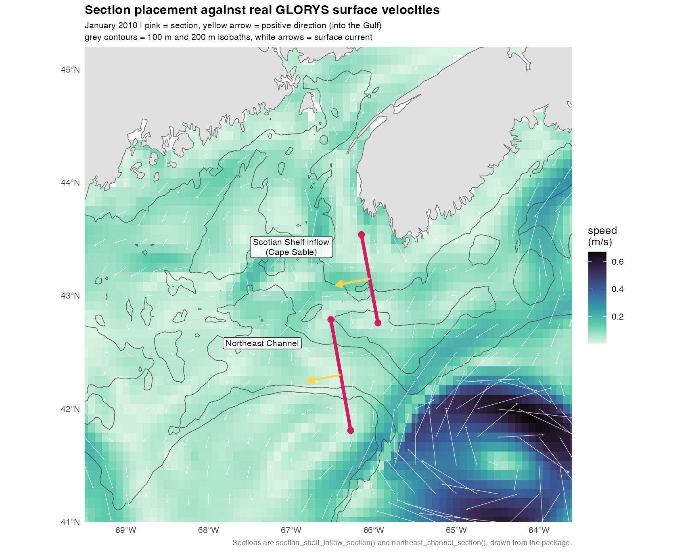
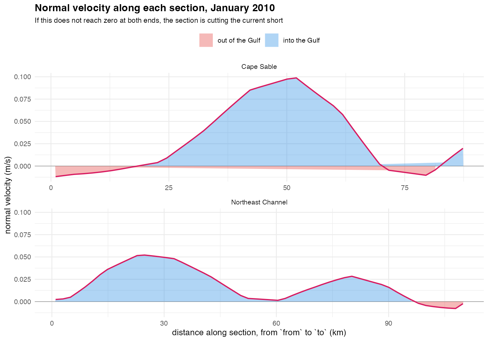

# How each derived covariate is computed, and why

This is the reasoning behind the numbers: what each quantity means, how it is
calculated, which choices were deliberate, and where the results differ from the
older pipeline they replace. The function documentation says *what*; this says
*why*.

<details>
<summary><b>Contents</b></summary>

- [Context](#context)
- [The data shape](#the-data-shape)
  - [Column names come from the catalog](#column-names-come-from-the-catalog)
  - [Not every column is a covariate](#not-every-column-is-a-covariate)
  - [Why this is a warning and not a narrower default](#why-this-is-a-warning-and-not-a-narrower-default)
  - [Non-numeric columns are an error instead](#non-numeric-columns-are-an-error-instead)
- [Horizontal gradients](#horizontal-gradients)
  - [The unit question, which is the whole design](#the-unit-question-which-is-the-whole-design)
  - [Why this is not `raster::terrain()`](#why-this-is-not-rasterterrain)
- [Vertical gradients](#vertical-gradients)
- [Temporal gradients](#temporal-gradients)
- [Lags](#lags)
- [Time integration](#time-integration)
- [Distance to fronts and contours](#distance-to-fronts-and-contours)
  - [What counts as a front](#what-counts-as-a-front)
  - [Contours and isobaths](#contours-and-isobaths)
- [FTLE](#ftle)
  - [Details that matter](#details-that-matter)
  - [On monthly data](#on-monthly-data)
- [FSLE, and when to prefer it over FTLE](#fsle-and-when-to-prefer-it-over-ftle)
  - [Why the difference matters ecologically](#why-the-difference-matters-ecologically)
  - [Two caveats that outweigh the choice](#two-caveats-that-outweigh-the-choice)
  - [Implementation notes](#implementation-notes)
- [The domain is smaller than it looks](#the-domain-is-smaller-than-it-looks)
- [How the named sections were placed](#how-the-named-sections-were-placed)
  - [Two diagnostics](#two-diagnostics)
  - [What the first placement showed](#what-the-first-placement-showed)
  - [How the replacements were found](#how-the-replacements-were-found)
  - [The bathymetric cross-check](#the-bathymetric-cross-check)
  - [After, on the window it was fitted to](#after-on-the-window-it-was-fitted-to)
  - [The seasonal re-check, which found the fit was too narrow](#the-seasonal-re-check-which-found-the-fit-was-too-narrow)
  - [A limit no placement can fix](#a-limit-no-placement-can-fix)
  - [The transport reverses in summer, and that is the signal](#the-transport-reverses-in-summer-and-that-is-the-signal)
  - [The sign convention, checked rather than assumed](#the-sign-convention-checked-rather-than-assumed)
  - [What this does not settle](#what-this-does-not-settle)
- [Region-scale indices](#region-scale-indices)
  - [Three ways of measuring one thing](#three-ways-of-measuring-one-thing)
  - [Why the endmembers have no default](#why-the-endmembers-have-no-default)
- [Eddy kinetic energy](#eddy-kinetic-energy)
- [Requirements on the input, and what is rejected](#requirements-on-the-input-and-what-is-rejected)
  - [Resampled input passes the check, and that is the problem](#resampled-input-passes-the-check-and-that-is-the-problem)
- [How this is tested](#how-this-is-tested)
- [Since resolved elsewhere](#since-resolved-elsewhere)
- [Not yet implemented](#not-yet-implemented)
- [FTLE at depth](#ftle-at-depth)

</details>

## Context

The pipeline these covariates feed —
[`taupatch`](https://github.com/chross22/taupatch), rebuilt from Ross et al.
(2023) — models high-abundance zooplankton patches from environmental
conditions. The environmental variables Copernicus serves directly (temperature,
salinity, currents, chlorophyll) describe *what conditions are*. The derived
quantities here describe *how conditions are arranged and how they are changing*,
which is often what actually concentrates plankton:

- A **front** — a sharp horizontal gradient — is a convergence zone where
  buoyant particles and weak swimmers accumulate. The temperature itself may be
  unremarkable on both sides; the *change* is what matters.
- **Stratification** — a vertical gradient — determines whether the surface layer
  is isolated from deep water, which controls both nutrient supply and where
  animals can stay.
- **Accumulated** food matters more than instantaneous food, because a copepod
  sampled in June grew on the spring bloom.
- **Lagged** conditions matter because population responses take time.

## The data shape

Everything takes and returns the output shape of
[`datamatch::accessEnvDat()`](https://github.com/chross22/datamatch): an `sf`
POINT object with one row per (grid point, time step), a column per covariate,
and `YEAR`/`MONTH`/`DAY` columns.

Keeping input and output shapes identical is what lets the functions compose:

```r
env |> horizontal_gradient("SST") |> lag_covariate("SST")
```

Internally, spatial operations need a grid, so each time step is rasterized,
operated on, and sampled back to the points (`per_time_step()` in `R/grid.R`).
Temporal operations work directly on the point table, matching locations by
coordinate.

### Column names come from the catalog

`accessEnvDat()` returns columns under the names that were requested, so a fetch
of `vars = c("SST", "BOTT")` yields columns `SST` and `BOTT` rather than the
Copernicus codes `thetao` and `bottomT`. Every default column name here is a
[`variable_dictionary()`](https://github.com/chross22/datamatch) name — `SST`
and `BOTT` for `vertical_gradient()`, `UO`/`VO` for `eke()`, `current_speed()`,
`ftle()`, and `fsle()`, `DEPTH` for `distance_to_isobath()`.

That is a convenience, not an assumption: raw Copernicus codes still work at the
fetch, and every function takes the column names as arguments. The defaults
simply match what a dictionary fetch produces, so the common case needs no
arguments.

### Not every column is a covariate

"Covariate" here means everything that is not `YEAR`/`MONTH`/`DAY` or the
geometry — that is what `vars = NULL` expands to, via the internal
`covariate_columns()`, and `datamatch::covariate_columns()` reports the same set
if you want to see it. That set is now wider than it was when these functions
were written, because `datamatch` attaches three other kinds of column:

| Source | Columns | What they break | Response |
|---|---|---|---|
| `attach_bathymetry()` | `DEPTH`, `SLOPE`, `ASPECT`, `TPI` | static — no temporal derivative, no meaningful integral | warning |
| `attach_climate_index()` | `NAO`, `AO`, `AMO`, `PDO`, `LCR`, `AMOC` | no spatial dimension — horizontal gradient is identically zero | warning |
| `fill_satellite_gaps()` | `<var>_source` | a factor, not a measurement | error, or skipped |

The `vars = NULL` default — "all covariates" — dates from when the input was a
plain Copernicus fetch and every column was a gridded time-varying field. It is
still right for that case and wrong for an enriched object.

### Why this is a warning and not a narrower default

The tempting fix is to teach `vars = NULL` to skip these columns. It does not
work, because whether a column belongs depends on the *operation*, not on the
column. `DEPTH` is a perfectly sensible thing to take a horizontal gradient of —
that is slope, a genuinely useful predictor — and a meaningless thing to lag.
`NAO` is the mirror image: lagging it is real, and its horizontal gradient is
zero by construction. Any rule that silently dropped columns would be right for
one function and wrong for the other, and wrong *invisibly*: a covariate quietly
absent from the output is much harder to notice than one that is present and
useless.

So `resolve_vars()` takes the operation as an argument and warns, rather than
choosing for the caller:

| | `kind = "temporal"` | `kind = "spatial"` |
|---|---|---|
| static — constant through time at each location | warns | fine |
| spatially uniform — constant across the grid within each step | fine | warns |

Both are the same test, `constant_within()`, differing only in what they group
by: location for one, time step for the other. That is why the check is on the
data rather than on a list of known column names — nothing here needs to know
that `TPI` came from bathymetry, only that it does not change. A covariate that
happens to be constant in a particular extract is caught on the same footing.

Comparison is exact, so a nearly-flat field never trips it; only a genuinely
constant one does. A column that is entirely `NA` returns `FALSE` rather than
`TRUE` — it has a more obvious problem than this one, and reporting it here
would bury that. A single-time-step object skips the temporal check entirely,
since every column is trivially constant through time and the operation is
already all-`NA`.

Two functions are wrappers — `temporal_gradient()` delegates to
`lag_covariate()`, `distance_to_front()` to `horizontal_gradient()` — and pass
`kind = "any"` so the inner call issues exactly one warning per user-facing call.

### Non-numeric columns are an error instead

`fill_satellite_gaps()` adds a `<var>_source` factor. Unlike the degenerate
cases, there is no well-defined computation to warn about: a factor cannot be
differentiated or summed at all. Naming one explicitly is therefore an error.

`vars = NULL` skips them silently, which is the asymmetry worth justifying: a
caller who never mentioned `CHL_source` did not intend it, and erroring over a
column they did not ask for would make the `NULL` default unusable on every
gap-filled object. Explicit request, explicit failure; implicit sweep, implicit
skip.

---

## Horizontal gradients

**What:** the magnitude of a covariate's rate of change with horizontal distance,
`|∇C|`, in covariate units per kilometre.

**How:** central differences on the covariate's own grid.

```
∂C/∂x ≈ (C[i+1,j] - C[i-1,j]) / 2Δx
∂C/∂y ≈ (C[i,j+1] - C[i,j-1]) / 2Δy
|∇C|  = sqrt((∂C/∂x)² + (∂C/∂y)²)
```

Central differences rather than one-sided ones because they are second-order
accurate — the leading error term cancels — for the same computational cost. The
price is that the grid boundary has no value, since one neighbour is missing.
Those cells come back `NA` rather than being filled by a one-sided estimate,
because a boundary value computed by a different formula is not comparable to the
interior ones.

### The unit question, which is the whole design

The naive implementation leaves Δx and Δy in **degrees**. That is wrong in a way
that is easy to miss, because the output still looks like a sensible field.

A degree of latitude is about 111.32 km everywhere. A degree of *longitude* is
111.32 km at the equator and shrinks as `cos(latitude)`:

| Latitude | km per degree longitude |
|---|---|
| 0° | 111.3 |
| 35° | 91.2 |
| 42° | 82.7 |
| 45° | 78.7 |

Across taupatch's study area (35°N–45°N) that is a 16% spread. A gradient left in
per-degree units is therefore stretched by latitude: the same physical front
registers as a *weaker* east-west gradient in the north than in the south, purely
as an artifact. A model would learn that artifact as if it were a latitudinal
gradient in front strength.

So the spacing is converted to distance before dividing:

```
Δx(metres) = Δx(degrees) × 111320 × cos(latitude)
Δy(metres) = Δy(degrees) × 111320
```

`cos(latitude)` is evaluated **per grid row**, not once for the whole grid. Using
a single central latitude would leave a residual error across the domain —
roughly 30% at 45° for a wide grid.

`cell_size()` handles projected rasters too: if the CRS is already in linear
units, the resolution is used directly with no conversion.

The 111320 m figure is the mean-Earth-radius value. The true value varies by a
few tenths of a percent with latitude because the Earth is oblate; that is far
below the error in the underlying model fields and is not worth correcting.

### Why this is not `raster::terrain()`

The older pipeline computed `sst_grad` and `uv_grad` with `raster::terrain(sst)`.
That function is built for **elevation** models. It assumes the cell values are a
length in the same units as the coordinates and returns a **slope angle**:

```
slope = atan(sqrt((∂z/∂x)² + (∂z/∂y)²))
```

For a temperature field this is dimensionally meaningless — it takes the
arctangent of a quantity in °C per degree-of-longitude, which is not an angle and
not anything else. It also saturates: `atan` compresses everything above a
moderate gradient toward π/2, so genuinely sharp fronts become indistinguishable
from moderate ones.

In practice the old values were probably still *useful*, because `atan` is
monotonic — a bigger gradient still gave a bigger number, so the random forest
could use it as a front detector. But the values were not a rate of change, were
not comparable across latitudes, and could not be interpreted or compared to
anything published in physical units.

**This means derived gradients here are not numerically comparable to the ones in
Ross et al. (2023).** Lags and integrals are; gradients are not. If bit-level
reproduction of the published model is ever needed, that would require adding a
`method = "terrain"` option rather than reinterpreting the current output.

---

## Vertical gradients

**What:** surface temperature minus bottom temperature in each cell — a
stratification index. Large where a warm surface layer sits over cold deep water;
near zero where tide and wind have mixed the column through.

**How:** a column-wise difference, `SST - BOTT`.

There is no depth-profile interpolation here, and deliberately so. Copernicus
serves `thetao` (surface) and `bottomT` (sea floor) as two separate variables in
the *same* physics dataset — `SST` and `BOTT` in the catalog — so both arrive in
a single fetch and the difference is already the quantity of interest.

This is worth stating because the obvious alternative is still not available in
one call. `accessEnvDat()` assigns its output column names **positionally**
(`c("x", "y", vars, "YEAR", "MONTH", "DAY")`), so it can only handle one raster
layer per requested variable. A `depth` range spanning several model levels
returns more layers than that, and datamatch now checks the count and stops:

```
Expected 1 variable column(s) but the download returned 3. This usually means
the depth range spans several model levels; request a single level, or one
variable at a time.
```

That is the change worth knowing: the failure mode used to include *silently
mislabelled columns*, where a caller could get a temperature field named as a
salinity one. It is now a refusal with a diagnosis. A true `dT/dz` from
intermediate levels still needs one fetch per level, stacked afterwards; the
surface-to-bottom difference sidesteps that entirely.

With a `depth` column supplied, the difference is divided by depth to give a
per-metre rate rather than a total difference. That column now has an obvious
source — `datamatch::fetch_bathymetry()` and `attach_bathymetry()` return
`DEPTH` from NOAA ETOPO, on whatever grid the environmental data is on:

```r
bathy <- datamatch::fetch_bathymetry(bounding_box = bb)
env   <- datamatch::attach_bathymetry(env, bathy, "DEPTH")
env   <- vertical_gradient(env, depth = "DEPTH")
```

ETOPO depth and the Copernicus model's own bathymetry are not the same number —
the model has its own discretised sea floor, and `bottomT` is the temperature at
*that* depth, not at ETOPO's. Over most of a shelf the difference is small
relative to the stratification signal, but the rate is a ratio of two sources
rather than one, which matters most where they disagree most: steep slopes and
canyon walls, where a coarse model level and a finer terrain grid can differ by
tens of metres.

Depths of zero or less become `NA` rather than `Inf` or a sign flip — a cell on
land or at the waterline has no meaningful stratification rate.
`attach_bathymetry()` already masks land to `NA`, so the two agree.

---

## Temporal gradients

**What:** the rate of change at a fixed location between consecutive time steps.
A water mass warming quickly is a different habitat from one sitting at the same
temperature.

**How:** `(C[t] - C[t-1]) / Δt`, built on `lag_covariate()`.

`Δt` depends on `per`:

- `"step"` (default) — change per time step, `Δt = 1`. Correct when steps are
  evenly spaced, which monthly products are in index terms.
- `"day"` — divides by the actual number of days between steps, from the calendar
  dates. Month lengths vary from 28 to 31 days, an 11% spread, so this differs
  from `"step"` by more than rounding.
- `"month"` — divides by days, then by 30.4375 (the mean Gregorian month), giving
  a nominal per-month rate on an even footing.

The first time step has no predecessor and is `NA`.

---

## Lags

**What:** a covariate's value `n` time steps earlier at the same location.

**How:** for each step, find the step `n` back and match points by coordinate.

**Matching by coordinate, not by row order,** is the important detail. It would
be simpler to assume both steps list their grid points in the same sequence, and
that assumption usually holds — until a fetch is reordered, a step is missing
points, or two products are joined. When it breaks, the failure is silent: every
row gets *a* value, just the wrong cell's. So `location_key()` builds a rounded
coordinate string and matches on that. Rounding (6 decimal places, ~0.1 m)
absorbs float noise from coordinates written and re-read at different precisions.

The first `n` steps have no predecessor and are `NA`.

`n = 1` reproduces the older pipeline's `lag_sst` exactly.

---

## Time integration

**What:** a covariate accumulated over preceding time steps at each location. The
food a survey encounters is the food built up since the season began, not the
instantaneous concentration.

**How:** sum over the contributing steps, with `window` controlling which those
are:

- `"year"` (default) — every step so far in the same calendar year, reset at the
  year boundary. This reproduces the older pipeline's `int_chl`, which summed
  chlorophyll from January.
- `"all"` — every step from the start of the record, never resetting.
- a positive integer — a rolling total over that many trailing steps, crossing
  year boundaries.

The year reset is not arbitrary. It encodes the assumption that the biological
year restarts — that January's productivity is the beginning of a new growing
season rather than a continuation of December's. That is defensible in the Gulf
of Maine, where the spring bloom is the dominant annual event, and it is what the
published model did. A rolling window makes no such assumption, which is why it
is available.

**Missing values are counted, not treated as zero.** If a location is absent from
a contributing step, adding zero would understate the total while looking like a
real number. Instead, each contributing step is tracked; a location with no
contributing steps at all returns `NA`, rather than a spurious total of 0.

---

## Distance to fronts and contours

**What:** how far each point is from the nearest front, or from a named contour
such as an isobath.

**Why not just use the gradient:** the local gradient is a blunt predictor of
frontal influence. A station in the middle of a smooth patch has a gradient of
zero whether the nearest front is 2 km away or 200 km away, and those are very
different places to be — plankton accumulate *near* fronts, not only exactly on
them. Distance separates the two cases; the gradient cannot.

**How:** threshold the gradient to identify frontal cells, then run a distance
transform (`terra::distance()`) from every cell to the nearest frontal one.

### What counts as a front

`scope` decides what the quantile threshold is taken over, and the two answers
answer different questions:

- **`"record"`** (default) — one threshold across the whole series, so "front"
  means the same physical sharpness every month. A weakly stratified winter may
  then contain *no* fronts. That is a real result, and suppressing it would be
  the error.
- **`"step"`** — a separate threshold per time step, so every month has fronts by
  construction. Right when the question is where this month's sharpest features
  are; wrong when the question is whether this month has sharp features at all.

A time step with no front gives `NA`, not `0`. Reporting zero would assert "you
are standing on a front", the opposite of the truth.

### Contours and isobaths

`distance_to_contour()` measures to where a covariate crosses a value —
`distance_to_isobath()` is the depth case. Position relative to a contour is
frequently the better predictor: plankton track the shelf break, and "20 km
inshore of the 100 m isobath" locates that far better than "depth = 85 m".

A contour almost never falls exactly on a cell centre, so a cell is marked as on
the contour when the level lies between its value and any neighbour's — detected
with a 3×3 focal range of the above/below indicator. Testing for exact equality
would find nothing on coarsely quantised data.

---

## FTLE

**What:** the Finite-Time Lyapunov Exponent — how fast two initially neighbouring
water parcels separate, in units of 1/day. Ridges mark Lagrangian coherent
structures: the lines that organise surface transport.

**Direction is the substantive choice**, which is why it is an argument:

- **Backward** (default) integrates into the past, so ridges are *attracting*
  structures — where water arriving from different origins converges. This is
  where buoyant particles and weak swimmers pile up, so it is usually the
  direction of interest for aggregation.
- **Forward** integrates into the future, so ridges are *repelling* structures —
  barriers that neighbouring parcels straddle and are pulled apart by.

**How:**

1. Seed particles on the covariate grid at each time step.
2. Advect them with fourth-order Runge-Kutta through the time-varying velocity
   field, bilinear in space and linear in time between bracketing fields.
3. Differentiate the resulting flow map by central differences to get the
   deformation gradient `F`.
4. Form the Cauchy-Green strain tensor `C = FᵀF` and take its largest eigenvalue.
5. `σ = ln(√λ_max) / |T|`.

The 2×2 eigenvalue is closed-form, so there is no per-cell `eigen()` call.

### Details that matter

**Velocities are converted from m/s to degrees per day at every evaluation
point**, with the longitude conversion scaled by `cos(latitude)` — the same
meridian-convergence issue as for gradients, but here it affects the trajectory
itself, not just the reported unit.

This has a consequence worth stating, because it looks like a bug: **a constant
velocity in m/s does not give zero FTLE.** Meridians converge poleward, so a
parcel at 43°N sweeps through more longitude per second than one at 42°N. That
differential is genuine shear. Across 42–43°N it is about 1.6%, giving an FTLE
around 6×10⁻⁴/day — orders of magnitude below real fronts (0.01–0.1/day), but not
zero. Only a motionless field gives exactly zero.

**Positions are converted to metres on an equirectangular plane about the grid
centre** before differentiating, so the strain tensor is computed in one
consistent metric rather than mixing degrees of longitude and latitude, which have
different physical lengths.

**λ < 1 is clamped to 1.** A window over which parcels net *converge* is a real
result, but it is not an exponential separation rate, and `ln` of it would be
negative. Clamping reports zero separation rather than a negative exponent.

**Particles are clamped at the ends of the record** rather than extrapolated: one
that runs past the available fields is held in the last known flow, a milder error
than inventing velocities.

### On monthly data

Monthly-mean velocity fields have already averaged away the eddies that generate
the sharpest structures. FTLE from monthly means is a real diagnostic of the mean
circulation, but it is not the same quantity as FTLE from daily fields, and its
ridges are correspondingly smoother. Prefer a `P1D` product where the choice
exists.

`integration_days` sets the scale of structure resolved: too short and no
separation has accumulated; too long and ridges blur as particles wander far from
where they started. Days to a few weeks is the usual mesoscale range.

---

## FSLE, and when to prefer it over FTLE

Both find the same objects — Lagrangian coherent structures — but they ask
inverse questions:

| | FTLE | FSLE |
|---|---|---|
| You fix | the integration time `T` | the separation `δ_f` |
| It reports | how far parcels separated | how long separation took |
| Formula | `ln(√λ_max)/T` | `ln(δ_f/δ_0)/τ` |
| Natural when | the *timescale* is meaningful | the *spatial scale* is |
| Across energy regimes | confounded with flow speed | comparable |
| Cost | fixed and bounded | variable; parcels may never reach `δ_f` |
| Record needed | `T` | potentially much longer |

### Why the difference matters ecologically

**FSLE is scale-selective; FTLE is not.** `δ_f` targets structures at a chosen
spatial scale, and organisms respond at particular scales — a predator's search
radius, a patch, a survey's resolution. FTLE with fixed `T` returns whatever
scale the local flow happens to produce in that time.

**FSLE is comparable across a heterogeneous domain, and a shelf is
heterogeneous.** An energetic shelf-break current and a sluggish interior, mapped
with one fixed `T`, give crisp ridges in the fast region and washed-out structure
in the slow one. Ridge intensity then partly encodes background current speed
rather than frontal activity, and a model fed that covariate cannot tell the two
apart. FSLE asks the same question everywhere, so the answer means the same thing
everywhere.

**FTLE's fixed window is an advantage when the timescale is known.** If the
relevant duration can be named — a retention time, the window over which a cohort
accumulates, time since a bloom — FTLE with `T` set to it answers exactly that
question. FSLE has nowhere to put that knowledge.

### Two caveats that outweigh the choice

**Monthly fields undercut both.** A `P1M` product has already averaged away the
mesoscale eddies that generate sharp LCS. Either diagnostic computed from monthly
means describes the *mean circulation*, not the transient structures usually
associated with aggregation. Moving to a `P1D` product matters more than the
choice between them.

**Plankton are not passive surface tracers.** *C. finmarchicus* CV overwinter at
depth and ascend seasonally, and most copepods migrate vertically each day.
Surface FTLE/FSLE describes surface transport, which is most defensible for
surface-associated stages and seasons. Computing at the depth the modelled stage
actually occupies is the more faithful approach, and is possible — Copernicus
GLORYS carries `uo`/`vo` on 50 levels.

### Implementation notes

Each seed is advected together with two companions offset east and north by
`δ_0`, and the separation of each pair is checked after every step; `τ` is the
first time either reaches `δ_f`.

**`δ_0` defaults to the smaller of the two cell dimensions**, so both companions
start within one grid cell. At 42.5°N a 0.1° grid gives 8.2 km east-west and
11.1 km north-south, so longitude sets it.

**Parcels that never reach `δ_f` within `max_days` return `NA`, not `max_days`.**
The question has no answer for them, and substituting the cap would report a slow
separation rate where there was none — inventing weak structure everywhere the
flow is quiet.

**Converged parcels stop being advected.** Without that, every parcel integrates
for the full `max_days` even after its answer is known, which dominates runtime:
in a real field most pairs separate early and the long tail is a small minority.
Parcels that drift off the grid lose their velocity and are retired unanswered.

---

## The domain is smaller than it looks

Both diagnostics follow parcels through the velocity field, and a parcel that
reaches the edge of the data has no velocity to follow. It is retired, and its
cell returns `NA`. So the usable area is never the area fetched: it is the area
fetched minus a margin of roughly **speed × integration time**, on the upstream
edge for backward integration and the downstream edge for forward.

That margin is larger than it sounds. A shelf speed of 0.15 m/s over the default
14 days is about 180 km. On a 500 km box that is a third of the field. On a 1°
box it is the whole thing, and the result is uniformly `NA`.

The NAs are individually correct, and the arithmetic is easy to verify: in a
uniform westward flow the boundary of the `NA` region sits exactly
`speed × integration_days` from the upstream edge. What was wrong was returning
an empty column in silence, which is indistinguishable from a broken function.

So `ftle()` counts the particles whose trajectories left the field, and `fsle()`
counts the two failures separately: pairs lost to the edge, and pairs that stayed
inside but never reached `final_separation`. When almost everything is `NA` the
warning reports those counts along with the median speed, the reach over the
window, and the size of the box.

**The two FSLE causes want opposite fixes**, which is why they are not merged.
Parcels lost to the edge need a *shorter* `max_days`, so they finish before
leaving. Parcels that never separated need a *longer* one, or a smaller
`final_separation`, or a daily product with eddies still in it. A single message
covering both would have to advise both directions at once, which is no advice.

The threshold for warning is 0.9. Losing a margin is the normal condition, not an
error, and a warning on every ordinary call is one the reader learns to skip.

---

## How the named sections were placed

`scotian_shelf_inflow()` and `northeast_channel_inflow()` have fixed endpoints,
so those endpoints are part of the definition rather than a detail. This is how
they were arrived at, and how anyone can check them again.

The short version: the first pair were placed by reading a map, and measuring
them against real velocities showed one of them was measuring the wrong thing.

### Two diagnostics

A section is well placed when the current crosses it rather than running along
it, and when the section spans the current rather than cutting through it. Those
give one number each.

**Capture fraction** is `|mean flow · n̂|` over `|mean flow|`, where `n̂` is the
section normal. It is 1 when the flow is exactly perpendicular to the section
and 0 when the flow runs parallel. A low value means most of the water is
sliding past rather than through, and the transport is a small residual of a
much larger flow.

**Endpoint ratio** is the larger of the two endpoint normal velocities over the
peak along the section. Near zero means the flow has died away by the time the
section ends, so the section spans it. Large means the current continues past
the endpoint and the transport is truncated at an arbitrary place.

Both matter, and they fail differently. A section can be perfectly perpendicular
and still too short.

### What the first placement showed

Measured against GLORYS monthly surface velocities for January–April 2010:

| | Cape Sable | Northeast Channel |
|---|---|---|
| Flow vs. normal | 50° | 75° |
| Capture fraction | 0.65 | **0.27** |
| Endpoint normal velocity | −0.071 / +0.011 m/s | +0.030 / −0.031 m/s |

The Northeast Channel section was the serious one. At 75° it ran nearly *along*
the channel axis, so barely a quarter of the flow passed through it. Its normal
velocity profile was positive for the first 40 km and negative for the last 28,
which means the reported transport was the difference between two opposing
flows — a quantity acutely sensitive to exactly where the endpoints sit, and not
a robust index of anything.

Cape Sable was better but truncating. Its largest normal velocity anywhere on
the section was at the very first sample, −0.071 m/s, so the inshore end sat in
outflow that had not died away.

### How the replacements were found

A search over candidate centres, orientations, and lengths, scoring each on
`capture − 0.5 × endpoint_ratio` and requiring net transport to be positive into
the Gulf in every month. Scoring used all four months rather than one, so the
result is not fitted to January's circulation.

Candidates that left the water at any sample point were rejected outright, since
a section running onto land integrates over a gap.

The script is [`docs/section-placement-diagnostics.R`](section-placement-diagnostics.R),
and it needs only a GLORYS `uo`/`vo` extract to re-run.

### The bathymetric cross-check

A flow-derived answer alone would be overfitting: the best section for one
season's currents is not necessarily the right physical section. So the
Northeast Channel result was checked against ETOPO depth, which is what defines
that channel in the first place.

Along the chosen line at about 66.4°W, depth runs roughly **120 m → 250 m →
80 m**: it starts on the Browns Bank side, crosses the deep channel, and ends on
Georges Bank. That is a crossing. The original line stayed inside the deep water
for its whole length, which is the geometric signature of running along a
channel rather than across it.

### After, on the window it was fitted to

| | Cape Sable | Northeast Channel |
|---|---|---|
| Flow vs. normal | 50° → **9°** | 75° → **21°** |
| Capture fraction | 0.65 → **0.99** | 0.27 → **0.93** |
| Endpoint normal velocity | → −0.012 / +0.020 m/s | → +0.002 / −0.002 m/s |

Those numbers are from January–April 2010, the same four months the search
scored on, and they are too good. See the next section.

### The seasonal re-check, which found the fit was too narrow

Four months sounded like enough to avoid fitting one month's circulation. It was
not, because all four came from the same year. Re-scoring on **60 months**
(2008–2012) told a different story:

| | fitted window (2010) | five winters | five summers |
|---|---|---|---|
| Cape Sable capture | 0.99 | 0.75 | 0.65 |
| Northeast Channel capture | 0.93 | **0.59** | 0.80 |

The Channel section had been tuned to a single winter and lost a third of its
capture on the others. So the search was re-run over all 60 months, scoring
`capture − 0.5·sd(capture) − 0.5·endpoint`, which rewards a section that works
consistently rather than one that peaks somewhere.

**The Northeast Channel section moved.** The replacement is better on every
measure:

| | before | after |
|---|---|---|
| Capture, five winters | 0.59 | **0.84** |
| Capture, all 60 months | 0.67 | **0.80** |
| Endpoint ratio | 0.45 | **0.36** |
| Winter transport | +456 | **+1,688** m²/s |
| Winters with positive transport | 70% | **80%** |

Depth along it runs 60, 126, 222, 253, 253, 201, 82, 81, 73 m: bank, channel,
bank, so it is still a crossing and not merely a better-scoring line.

**The Cape Sable section did not move**, and the reason is worth recording. The
60-month search found an orientation scoring higher on capture, 0.78 against
0.72. It was rejected: its winter transport collapsed from about +1,400 to +160
m²/s, and only 45% of winters came out positive against 75% before. It aligned
better with the *total* flow while nearly cancelling the *inflow*, which is the
thing the index exists to measure. Capturing the signal beats capturing the flow.

### A limit no placement can fix

Capture has a standard deviation of about 0.25 in every candidate tested. The
flow direction itself rotates through the year, so no fixed line can be
perpendicular to it in every month. A section is a compromise across seasons, and
0.8 sustained is close to the practical ceiling here.

### The transport reverses in summer, and that is the signal

| | winter (Jan–Apr) | summer (Jun–Sep) |
|---|---|---|
| Cape Sable | +1,404 ± 2,869 | **−2,989** ± 2,939 |
| Northeast Channel | +1,688 ± 2,339 | **−2,744** ± 2,454 |
| Months positive | 75–80% | 10–20% |

Surface transport at both sections runs *out* of the Gulf through summer. This is
not a placement error and not a sign convention bug: it is what the surface layer
does once the winter inflow weakens, and both sections agree on it independently.

The convention stays anchored on winter, when inflow dominates, so positive
continues to mean into the Gulf. A summer value is a real negative rather than a
failure, and the search was written to allow it: requiring every month to be
positive would have selected a section incapable of seeing the reversal.

The standard deviations are as large as the means, so a single month's value
carries little. These are seasonal indices.





The profile figure is the one to read. A well-placed section shows a single
lobe that rises from zero and returns to zero. Two lobes of opposite sign, or a
curve that is still high at an endpoint, is the signature to act on.

### The sign convention, checked rather than assumed

Both normals point westerly — 259° and 260° compass — which at these sections is
into the Gulf. This was verified explicitly rather than inferred from the
endpoint order, because a sign error here is invisible: magnitudes stay entirely
plausible and only the interpretation inverts.

The regression test asserts the normal points west and is *mostly* west rather
than north, so editing an endpoint pair cannot silently flip the meaning of the
index. An earlier version of that test asserted a northwest normal, which was
true of the original sections and became wrong when they moved; a test that
encodes accidental geometry rather than the invariant is worse than none.

### What this does not settle

**Surface only.** These are one model level. The Northeast Channel is strongly
baroclinic, and Ramp et al. (1985) measured a persistent *deep* inflow there. A
surface section can run opposite to it. If depth-resolved velocities are
available, fetch them at channel depth and pass them to `section_transport()`.

**Five years, monthly.** 2008–2012 covers seasonal and some interannual
variation, but not a regime shift, and monthly means have averaged away the
storm-driven pulses that move a lot of water. The diagnostics are worth re-running
on the period actually being modelled.

**A model, not measurements.** GLORYS is a reanalysis. The sections are placed
correctly relative to *its* circulation.

---

## Region-scale indices

Most of this package returns a value per cell. Four functions do not: they return
one value per time step, broadcast to every row, describing an area rather than a
point. `section_transport()` and the two named inflows, `water_mass_fraction()`,
and `box_anomaly()` with its named case `eastern_gom_salinity()`.

That makes them behave like a climate index, and the degeneracy check treats them
as one: a horizontal gradient of a transport is identically zero, and
`horizontal_gradient()` says so.

`derived_indices()` is the catalogue, with the source behind each, and
`derived_indices(markdown = TRUE)` renders it for pasting elsewhere.

### Three ways of measuring one thing

Scotian Shelf inflow appears three times because the literature measures it three
ways, and they are not substitutes.

A **transport** integrates the flow normal to a line. It is the only one that
gives a direction and a flux, and the only one that needs velocities.

A **water-mass fraction** projects each cell's temperature and salinity onto the
mixing line between two endmembers. It measures how much of the water present
came from somewhere, which is what governs nutrients, and it works on products
that carry no velocity at all.

A **box anomaly** averages a covariate over a region and removes a reference. It
is the most robust of the three and the least specific: it says conditions
changed, not that water moved. A fresh anomaly in the eastern Gulf is consistent
with more Scotian Shelf inflow, and equally with local runoff.

They disagree informatively. Strong inflow with a normal salinity anomaly means
the arriving water was not unusually fresh, which is a finding about the upstream
shelf rather than a contradiction.

### Why the endmembers have no default

`water_mass_fraction()` requires them. They vary by region, season, and year, and
a wrong pair produces a confident number rather than an error, because projection
onto a line always returns something.

That is what `residual = TRUE` is for. It reports the distance from the mixing
line in the same normalised units: near zero means the two endmembers describe
the water, and large means they do not and the fraction is meaningless. Fractions
are clamped to `[0, 1]`, since a cell beyond an endmember indicates a third water
mass or a bad choice, and reporting 1.4 would dress that up as a measurement.

Temperature and salinity are normalised by the endmember separation before
projecting, so neither axis dominates for reasons of units rather than
oceanography.

---

## Eddy kinetic energy

**What:** `EKE = ½(u′² + v′²)`, the kinetic energy in the *departure* of the flow
from its mean. High EKE marks an energetic, variable region — meanders, rings,
eddies — as distinct from a strong but steady current, which carries high total
kinetic energy and little eddy energy.

**The reference is the whole design.** EKE is only defined relative to a mean, and
that choice decides what counts as an eddy. It is a scientific decision, so it is
an argument:

- **`"record"`** (default) — the mean over the whole series at each location. The
  textbook definition. The seasonal cycle of the mean circulation remains in the
  anomaly, so a region whose currents merely strengthen every summer registers as
  energetic.
- **`"climatology"`** — a separate mean per calendar month, removing the
  repeatable seasonal cycle so only departures from *the usual conditions for that
  month* count. Use when asking about anomalous years rather than about which
  places are energetic.
- **an integer** — a centred rolling mean over that many steps, removing slow
  drift so only variability faster than the window survives.

Means are computed **per location**, so a spatially varying mean circulation is
removed correctly rather than smeared into the anomaly. A domain-wide mean would
leave a large spurious anomaly wherever the mean flow differs from the domain
average — which, on a shelf with opposing currents, is everywhere.

`current_speed()` gives `sqrt(u² + v²)`, reproducing the older pipeline's `uv`;
passing it through `horizontal_gradient()` reproduces `uv_grad`.

---

## Requirements on the input, and what is rejected

`horizontal_gradient()` requires points on a **regular lon/lat lattice**.
`rasterize_step()` verifies this by checking that the unique longitudes and the
unique latitudes are each evenly spaced, and errors if not.

This rejection is deliberate. Gridded model output (Copernicus and similar) is
regular; scattered observations are not. It would be easy to accept anything and
interpolate onto a grid first, and the result would look completely plausible —
but a gradient field computed from interpolated data mostly measures the
interpolation, not the ocean. Failing loudly is better than returning a covariate
that silently encodes the sampling pattern.

Boundary cells are `NA`, as are the first `n` steps of a lag and the first step of
a temporal gradient. These are genuine absences, not failures.

### Resampled input passes the check, and that is the problem

`datamatch` now resamples in both directions on both axes — `upscale_grid()` /
`downscale_grid()` for space, `upscale_time()` / `downscale_time()` for time —
and its output is a regular lattice with the usual `YEAR`/`MONTH`/`DAY`
stamping. So `rasterize_step()` accepts it, correctly: it *is* a regular grid.
The lattice check catches scattered observations, not data whose resolution
overstates its information content.

The two interpolating directions are where a derivative stops meaning what it
says:

**Spatial downscaling.** A 0.25° field rendered at 4 km has 4 km cells and still
resolves nothing below 0.25°. `horizontal_gradient()` divides the difference
between neighbouring cells by the new, smaller Δx — so with `nearest` or `step`,
most neighbours are identical (gradient 0) and the cells at each source-cell
boundary carry the entire step concentrated into one 4 km interval, giving a
gradient several times larger than the real one. The output is a grid of zeros
with a lattice of spurious fronts on it, at exactly the spacing of the source
grid. `bilinear` spreads the step smoothly instead, which is worse for being
plausible: a smooth gradient field whose structure is the interpolant's.

The rule this implies: **derive on the native grid, then resample the
derivative.** `upscale_grid()` on an `SST_grad` column is an average of real
gradients; `horizontal_gradient()` on a downscaled `SST` is not.

**Temporal downscaling.** `downscale_time(method = "linear")` places a constant
slope between each pair of source steps, so `temporal_gradient(per = "day")`
returns that slope — a property of the interpolation, exactly constant within
each source interval and discontinuous at the joins. `method = "step"` is more
honest here and more obviously wrong-looking, which is the point: it gives zero
change on all but the transition days.

Aggregation is the safe direction, with one interaction worth naming.
`upscale_time()` returns `NA` for periods below `min_coverage` (0.5 by default),
and `integrate_covariate()` treats a missing location-step as a *non-contributing
step* rather than as a zero — so a partially-covered month drops out of the
running total instead of dragging it down. That is the intended behaviour of both
functions and they compose correctly, but it means an integral over a gappy
series is a sum over fewer steps than the calendar suggests. `keep_counts = TRUE`
on the upscale is how to see how many.

---

## How this is tested

Gradients are checked against fields whose derivatives are known analytically,
which is stronger than checking that output looks reasonable:

- A **uniform field** must give exactly zero everywhere.
- A **north-south ramp** of 1 °C per degree of latitude must give exactly
  `1/111.32` °C/km at *every* point, since latitude spacing does not vary. It must
  also put the entire signal in the northward component and none in the eastward
  one.
- An **east-west ramp** of 1 °C per degree of longitude must give
  `1/(111.32·cos(lat))` — that is, a value that *increases* toward the pole. This
  is the test that catches the per-degree mistake: the naive implementation
  returns a constant here, which is exactly what a plausible-looking wrong answer
  would look like.
- Changing the unit from km to m must scale the result by exactly 1000.
- A field that is flat in space but jumps between months must give zero spatial
  gradient — catching any pooling of time steps.

Temporal functions are checked against fields with a planted linear trend, and
lag matching is checked by **shuffling one time step's rows** and confirming the
answer is unchanged.

The degeneracy warnings are tested against a fixture carrying all three awkward
column kinds at once — a static `DEPTH`, a basin-wide `NAO`, and a factor
`SST_source`. What is checked is as much where the warning *does not* fire as
where it does: `horizontal_gradient(env, "DEPTH")` must stay silent, since that
is slope, and `lag_covariate(env, "NAO")` must stay silent, since a lagged index
is a real covariate. A check that fired on both would be indistinguishable from
one that simply recognised the column names.

Two more absences are pinned down, because both would make the warning fire on
correct input: a **single-time-step** object must not trip the static check, and
an **all-`NA`** column must not trip either. The wrappers are tested to warn
**once**, not once per internal call.

---

## Since resolved elsewhere

Two things this document once listed as missing are now `datamatch`'s, which is
the right side of the line: they are retrieval problems, not derivation ones.

- **Climate indices** — `attach_climate_index()` joins NAO, AO, AMO, PDO, LCR,
  and AMOC
  (Labrador Current retroflection) on
  year and month, broadcasting one basin-wide value across every point in a
  step. Nothing here derives from them, and nothing should: a horizontal
  gradient of a spatially constant field is zero, and a lag of one is just the
  index lagged. They are model covariates that sit alongside these, not inputs
  to them. The Gulf Stream Index is still outstanding, and for a reason that is
  not about which package it belongs in — it has several competing published
  definitions rather than one stable source.
- **Bathymetry** — `fetch_bathymetry()` / `attach_bathymetry()` give `DEPTH`,
  `SLOPE`, `ASPECT`, and `TPI` from NOAA ETOPO. This one does feed derivations:
  `DEPTH` is what `distance_to_isobath()` contours and what
  `vertical_gradient(depth = )` divides by.

  Note the overlap. `SLOPE` from `attach_bathymetry()` is `terra::terrain()` on
  the depth grid — a slope *angle* in degrees — while
  `horizontal_gradient(env, "DEPTH")` on the same column gives metres of depth
  per kilometre. For bathymetry specifically, unlike for temperature, the
  `terrain()` answer is the dimensionally correct one, since depth and distance
  are both lengths: this is precisely the case the [`raster::terrain()`
  critique](#why-this-is-not-rasterterrain) above does *not* apply to. They are
  monotonically related and either works as a covariate; do not use both, and do
  not compare either to the other's units.

## Not yet implemented

- **Vertical gradients from a depth profile** — the current implementation is
  surface-minus-bottom. A true `dT/dz` from intermediate levels needs several
  levels in one object, and `accessEnvDat()` returns one level per call (see
  above). Stacking per-level fetches is the missing piece.
- **Depth-resolved FTLE in one call** — same constraint, same workaround; see
  below.

## FTLE at depth

FTLE is computed from whatever velocity field it is handed, so depth-resolved FTLE
needs only depth-resolved velocities — no change here.

Copernicus does provide them: `GLOBAL_MULTIYEAR_PHY_001_030` (GLORYS12V1) carries
`uo` and `vo` on 50 vertical levels, so a fetch at a chosen `depth` returns the
flow at that level and `ftle()` runs on it unmodified.

```r
deep <- datamatch::accessEnvDat(
  vars = c("UO", "VO"), depth = c(100, 100),   # one level
  years = 2010, months = 1:12, bounding_box = bb
)
deep <- ftle(deep, integration_days = 14)      # UO/VO are the defaults
```

The constraint is on the fetching side. `accessEnvDat()` names its output columns
positionally, so it returns **one level per call** — and a `depth` range spanning
several levels is now refused outright, with an error naming the depth range as
the likely cause, rather than returning mislabelled columns. Depth-resolved FTLE
therefore means one fetch per level, each producing its own FTLE field, which
works today and is not a single call.

Worth knowing before doing it: horizontal velocities weaken and decorrelate with
depth, so sub-surface FTLE ridges are generally weaker and less coherent than
surface ones. Surface FTLE is also the case validated against drifters in the
literature; deeper fields are less constrained by observation.
