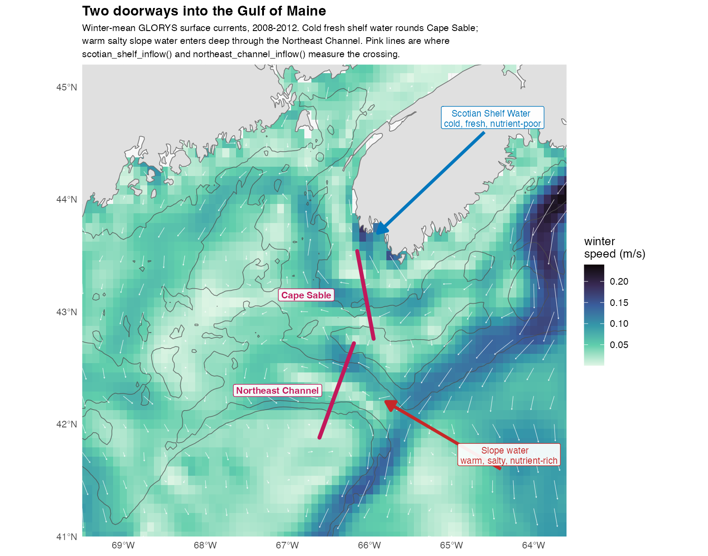

```{r setup, include = FALSE}
knitr::opts_chunk$set(collapse = TRUE, comment = "#>", eval = FALSE)
```

Every quantity derivoce derives, what it means, and why it is computed the way
it is. The "Getting started" vignette walks a worked example; this is the
reference behind it.

Nothing here runs when the vignette is built — the code is shown so it can be
read and copied, and a real fetch needs a network and Copernicus credentials.

## What it computes

### Horizontal gradients

`horizontal_gradient()` gives the magnitude of a covariate's change with
distance. That is what picks out fronts, the convergence zones where plankton
aggregate. It can return the eastward and northward components too.

Results are in **covariate units per kilometre**, not per degree. That matters:
a degree of longitude is about 83 km at 42°N but 111 km at the equator, so a
per-degree gradient is stretched by latitude and not comparable across a study
area. The longitude spacing is recomputed for every grid row.

This is a deliberate departure from the `raster::terrain()` call the original
pipeline used for `sst_grad` and `uv_grad` (Ross et al. 2023). `terrain()` returns a slope *angle*,
which is dimensionally meaningless for a field in °C. This returns a real rate of
change with a real unit.

### Vertical gradients

`vertical_gradient()` is the difference between two temperature columns in each
cell, a stratification index. It is large where a warm surface layer sits over
cold deep water, and near zero where the column is mixed. It defaults to
surface-minus-bottom, and both of those come from the same Copernicus dataset,
so the usual case needs no extra download.

The two columns are arguments rather than fixed, so any two levels work:
`accessEnvDat()` takes a `depth` and returns one level per call, so a second
fetch gives a temperature at whatever depth you choose. Where you know the two
depths, `buoyancy_frequency()` is the better measure — a temperature difference
stands in for stratification only where salinity is uniform, and Scotian Shelf
inflow is fresh enough to stratify water barely warmer at the surface.

Pass a `depth` column for a per-metre rate instead of a total difference.
`datamatch::attach_bathymetry()` supplies that column:

```r
bathy <- datamatch::fetch_bathymetry(bounding_box = bb)
env   <- datamatch::attach_bathymetry(env, bathy, "DEPTH")
env   <- vertical_gradient(env, depth = "DEPTH")   # degrees C per metre
```

### Temporal gradients, lags, and integrals

- `temporal_gradient()` gives the rate of change between consecutive steps, per
  step, per day, or per month. How fast conditions are shifting, as distinct from
  what they are.
- `lag_covariate()` gives the value *n* steps back. Populations respond with a
  delay: a bloom feeds the animals sampled a month later, not those sampled
  during it. Ross et al. (2023) used a one-month SST lag, which is
  `by = "month"` here.
- `integrate_covariate()` accumulates over preceding steps. A survey samples the
  food built up since the season began, not the food present at that instant. The
  default `window = "year"` reproduces the `int_chl` of Ross et al. (2023),
  chlorophyll integrated from January and reset each year. A numeric window rolls
  without resetting.

Locations are matched by coordinate, not row order, so time steps need not list
their points in the same order.

#### Lag by calendar time, not by position

`lag_covariate()` counts steps by default, which is only unambiguous when the
series is evenly spaced and complete. `by` counts calendar time instead:

```r
lag_covariate(env, "CHL", n = 3, by = "month")   # CHL_lag3month
lag_covariate(env, "SST", n = 1, by = "year")    # same month, last year
lag_covariate(env, "SST", n = 30, by = "day")    # daily products
```

Prefer a calendar unit whenever the lag means something biological. "Three
months ago" is a claim about the organism. "Three steps ago" is a claim about
how the data was fetched, and the two stop agreeing the moment a month is
missing. In a monthly series missing April, `by = "step"` makes March the
predecessor of May, so a one-step lag is quietly a two-month one. `by = "month"`
returns `NA` there instead.

`n` may be a vector, which is what an autoregressive design needs:

```r
lag_covariate(env, "SST", n = 1:3, by = "year")
# adds SST_lag1year, SST_lag2year, SST_lag3year
```

With `by = "year"` this holds the calendar month fixed and varies only the year,
so the seasonal cycle drops out and what remains is interannual.

### Anomalies, extremes, and density

- `cell_anomaly()` removes each cell's own mean, so what is left is the
  departure rather than the geography. Eight degrees is cold for the southern
  Gulf of Maine and warm for the Scotian Shelf, and a model given raw
  temperature has to learn that before it can use the difference.
  `standardize = TRUE` divides by the cell's own variability too, which makes
  departures comparable across the domain at the cost of the magnitude.
  `detrend = TRUE` also removes the long-term trend, which matters in a warming
  shelf sea: an anomaly that still contains the trend largely encodes *which
  year it is*. The cell-wise counterpart of `box_anomaly()`.
- `decompose_covariate()` splits a series into its parts — a trend, a repeating
  seasonal cycle, and the residual — additively, so each can be used or
  inspected on its own. `slope` gives the rate of change per year, one number
  per cell. The trend and the cycle are fitted **together**, because removed one
  after the other each absorbs part of the other.
- `index_series()` collapses a broadcast per-step column back to one row per
  time step. The region-scale indices below all compute one value per step and
  repeat it on every row so the object keeps its shape; this pulls the series
  back out for plotting or export. It refuses to collapse a column that varies
  across the grid, because that would keep one arbitrary cell and discard the
  map.
- `marine_heatwave()` flags periods unusually warm — or, with
  `direction = "cold"`, unusually cold — for the time of year, after Hobday et
  al. (2016, 2018), with intensity, duration, cumulative intensity and the four
  categories. Whether an animal was there in an ordinary summer or a heatwave
  summer is often more useful than the temperature itself.
- `potential_density()` gives sigma-theta from temperature and salinity, by the
  UNESCO (1983) equation of state. Density, not temperature, is what
  stratification and buoyancy depend on, and the two part company exactly where
  it matters here: Scotian Shelf inflow is cold *and* fresh, which pull density
  in opposite directions.
- `buoyancy_frequency()` gives N² between two depths — the real stratification
  measure, where `vertical_gradient()` only approximates it with a temperature
  difference. Needs a second `accessEnvDat()` call at a deeper `depth`, joined
  as columns.
- `eady_growth_rate()` says how fast baroclinic instability grows, from the
  vertical shear, the stratification and the Coriolis parameter. High where a
  sheared, weakly stratified flow can overturn — the shelf-break front and the
  edges of warm-core rings — so it complements `detect_eddies()`: that finds
  eddies which exist, this finds where conditions favour making them. (Eady is
  a person, not a spelling of "eddy".)

### Fronts, contours, and flow structure

- `distance_to_front()` measures how far each point is from the nearest front,
  usually a better predictor than the local gradient. Fronts are found by
  thresholding the gradient, after Belkin and O'Reilly (2009). A station in a smooth patch
  has zero gradient whether the nearest front is 2 km or 200 km away, and those
  are very different places to be.
- `distance_to_contour()` and `distance_to_isobath()` measure distance to where a
  covariate crosses a value. Plankton track the shelf break, and "20 km inshore of
  the 100 m isobath" locates that better than "depth = 85 m".
- `ftle()` and `fsle()` compute Lyapunov exponents (Haller 2015; d'Ovidio et al.
  2004). **Backward** (the default)
  finds *attracting* structures, where water converges and material accumulates.
  **Forward** finds *repelling* structures, the transport barriers. For
  depth-resolved versions, fetch velocities at a chosen depth: Copernicus GLORYS
  carries `uo` and `vo` on 50 levels.
- `front_frequency()` asks how *reliably* a front sits in a place, rather than
  how far one was at a moment. Fronts move: a cell frontal in one step of twenty
  caught a passing filament, while one frontal in fifteen sits on a shelf-break
  or tidal mixing front, and only the second aggregates plankton reliably enough
  for a predator to learn it.
- `flow_deformation()` gives vorticity, divergence, the strain components,
  the Okubo-Weiss parameter and the Rossby number from the velocity gradients.
  Instantaneous and local, so it sits between `eke()`, which needs a series, and
  the Lyapunov exponents, which need trajectories: separating an eddy interior
  from the filaments around it costs one pass rather than an integration.
- `detect_eddies()` goes from a field to objects: it groups the connected cells
  where rotation beats strain into individual eddies and describes each one, so
  a cell carries not "how eddy-like is the flow here" but "you are inside an
  eddy, it turns this way, and it is this big". Polarity is the part that earns
  its keep — cyclonic cores upwell and often concentrate plankton, anticyclonic
  ones downwell, and a covariate that only says "eddy" averages the two together
  and can easily find nothing.
- `distance_to_eddy()` completes the `distance_to_*` family. A station 5 km
  outside a rotating core and one 300 km away are different places, and an
  inside/outside flag scores both zero. `polarity` narrows it to cyclonic or
  anticyclonic.
- `residence_time()` releases a particle at every point in a box and measures
  how long it stays. Long residence means a retentive place where anything with
  a life stage measured in weeks can complete it. Read the censoring note in
  `?residence_time` before averaging the result.
- `eke()` computes eddy kinetic energy. You choose what the anomaly is measured
  against: the record mean, a monthly climatology, or a rolling window. That
  choice decides what counts as an eddy rather than mean flow.
- `current_speed()` gives speed from u and v, the `uv` of Ross et al. (2023).
  Their `uv_grad` is the spatial derivative of that speed field, so it is
  `current_speed()` then `horizontal_gradient()` on the result. Differentiating
  `u` and `v` separately and combining afterwards is a different quantity.
- `distance_to_shore()` gives kilometres to the nearest coast, from [Natural
  Earth](https://www.naturalearthdata.com/). Static, so it is computed once per location and shared across time steps.
  A broad proxy for several things at once: depth, terrestrial input, tidal
  mixing, and larval retention all covary with it. Useful as a covariate, poor as
  an explanation.

### FTLE or FSLE?

They ask inverse questions. **F**inite-**T**ime **L**yapunov **E**xponents fix
the integration time and measure how far parcels separate. **F**inite-**S**ize
**L**yapunov **E**xponents fix a separation and measure how long it takes.

```r
env <- ftle(env, integration_days = 14)   # "how much separation in 14 days?"
env <- fsle(env, final_separation = 50)   # "how long to separate by 50 km?"
```

Prefer **FSLE** when the *spatial* scale is what matters, or when the domain
spans very different flow speeds. One fixed integration time resolves fine
structure where the flow is fast and coarse structure where it is slow, so ridge
intensity ends up partly encoding current speed rather than frontal activity.
FSLE asks the same question everywhere.

Prefer **FTLE** when the *timescale* is what matters and can be named: a
retention time, a cohort's accumulation window, time since a bloom. FSLE has
nowhere to put that.

Two caveats outweigh the choice. Monthly fields have already averaged away the
eddies that make sharp structures, and plankton are not passive surface tracers.
[`docs/methods.md`](https://github.com/chross22/derivoce/blob/master/docs/methods.md) covers both.

### Regional indices

Most functions here give you a value for every grid cell. These four give you one
number per month for a whole region, like a climate index. They answer "how much
water came in this month", not "what was it like here".

Two currents feed the Gulf of Maine, and they carry very different water:



Cold, fresh, nutrient-poor water rounds Cape Sable from the Scotian Shelf. Warm,
salty, nutrient-rich water comes in deep through the Northeast Channel. The two
take turns, so which one is dominant changes what the Gulf is like that season.
That is why they are two indices and not one.

```r
env <- scotian_shelf_inflow(env)       # m^2/s, positive = into the Gulf
env <- northeast_channel_inflow(env)
```

#### Three ways to measure the same inflow

You can ask three different questions about Scotian Shelf water arriving, and the
literature asks all three. They are not interchangeable:

| Question | Function | Needs | Follows |
|---|---|---|---|
| How much water crossed this line? | `scotian_shelf_inflow()` | `UO`, `VO` | Feng et al. 2016; Wang et al. 2022 |
| How much of the water here came from there? | `water_mass_fraction()` | `SST`, `SSS` | Townsend et al. 2015 |
| Did the water here get fresher? | `eastern_gom_salinity()` | `SSS` | Grodsky et al. 2025 |

The first measures the flow itself, and is the only one that gives you a
direction. The second measures what is present rather than what moved, which is
what matters for nutrients, and it works on data with no currents in it. The
third is the simplest and the least specific: it tells you conditions changed,
not that water moved. Freshening could equally be rain or runoff.

Use more than one and disagreement is informative. Strong inflow with no
freshening means the water that arrived was not unusually fresh, which tells you
something about the Scotian Shelf that year.

```r
env <- water_mass_fraction(env, endmembers = list(
  LSW = c(temperature = 6,  salinity = 34.4),
  WSW = c(temperature = 12, salinity = 35.4)
), residual = TRUE)

env <- eastern_gom_salinity(env)
```

`derived_indices()` lists all of them with their sources.
`derived_indices(markdown = TRUE)` gives you a table to paste elsewhere.

#### Using your own line or box

The named indices have fixed geometry, because an index named after a place is
defined by that place. For anywhere else, use the general versions:

```r
env <- section_transport(env, from = c(-66.5, 43.3), to = c(-65.6, 42.6))
env <- box_anomaly(env, "SSS", box = list(xmin = -68, xmax = -66,
                                          ymin = 43, ymax = 44.5))
```

#### Before you use these

**They flip sign in summer.** Positive through winter, negative from June to
September, at both sections. That is the real surface circulation, not a bug.
Treat them as winter indices.

**The numbers are not comparable to published transports.** These integrate one
surface layer along a line. A mooring array integrates the full depth of the
section, so the figures differ by orders of magnitude. Read these as "more or
less than usual", not as a flux.

**The Northeast Channel changed after 2000.** Gulf Stream warm-core rings drive
slope water in, and ring formation nearly doubled around then (Silver et al.
2023). A record spanning 2000 covers two different regimes, so check any
long-term relationship on each side separately.

**Check the residual on `water_mass_fraction()`.** It always returns a fraction,
even for water that is not a mix of your two endmembers at all. `residual = TRUE`
is how you find out whether the answer means anything.

We chose the section endpoints ourselves by testing them against real currents;
they are not from any paper.
[`docs/methods.md`](https://github.com/chross22/derivoce/blob/master/docs/methods.md#how-the-named-sections-were-placed) shows how,
and [`docs/section-placement-diagnostics.R`](https://github.com/chross22/derivoce/blob/master/docs/section-placement-diagnostics.R)
re-runs the test on your own data.

#### A note on "Follows"

It means we implemented the idea, not that we reproduce the published series.
Each function computes from whatever data you give it, so the numbers will differ
from the paper's. Cite the paper for the concept and describe your own inputs.
Sources are also available as `as.data.frame(derived_indices())$source`, and all
work cited anywhere here is listed under [References](#references) at the end.

## Warnings you may see

### Mostly NA from FTLE or FSLE

This is the most common surprise, and it is not a failure. Both follow parcels
through the velocity field, and a parcel that reaches the edge of the data has no
velocity left to follow, so its cell returns `NA`.

That costs a margin of roughly **speed × integration time** around the domain. At
a shelf speed of 0.15 m/s the default 14 days is about 180 km, which removes a
third of a 500 km box and all of a 1° one:

```r
ftle(env, integration_days = 14)
#> Warning: ftle() returned no values at all: every point is NA.
#>   A 14-day integration at this field's median speed (0.2 m/s) carries a
#>   parcel about 250 km, and the domain is 82 by 110 km. 507 of 507 particles
#>   left the velocity field before the window was up.
#>   Shorten integration_days, or fetch a larger bounding box...
```

So **fetch a bounding box larger than your study area**, by about that margin.
Backward integration loses the upstream edge, forward the downstream one.

FSLE can also return nothing for a second reason: parcels that stay in the domain
but never separate by `final_separation`. Its warning tells the two apart,
because they need opposite fixes. Parcels lost to the edge want a shorter
`max_days`. Parcels that never separated want a longer one.

The warning only fires when almost everything is `NA`. Losing a margin is normal.

### A derivative that cannot carry information

`vars = NULL` means *every* covariate column, and datamatch now attaches columns
that are not covariates to differentiate. Asking for a derivative that cannot say
anything gets a warning naming the column:

```r
lag_covariate(env, "DEPTH")
#> Warning: Static covariate(s) in a temporal operation: DEPTH.
#>   These hold the same value at each location in every time step, so a lag
#>   reproduces the column, a temporal gradient is zero, and an integral is a
#>   running multiple of it...
```

Two degeneracies, each checked only against the operation it actually breaks:

| | Temporal (`lag_covariate()`, `temporal_gradient()`, `integrate_covariate()`) | Spatial (`horizontal_gradient()`, `distance_to_contour()`) |
|---|---|---|
| **Static**: `DEPTH`, `SLOPE`, `ASPECT`, `TPI` | warns | fine, this is how you get slope |
| **Spatially uniform**: `NAO`, `AO`, `AMO`, `PDO`, `LCR`, `AMOC` | fine, a lagged index is real | warns |

The test looks at the data, not at a list of known names, so a variable that
happens to be constant in your extract is caught too.

**Non-numeric columns are an error instead**, since nothing can be computed at
all. `fill_satellite_gaps()` adds a `<var>_source` factor. Naming it explicitly
fails, while `vars = NULL` skips it silently.

These warnings are a safety net, not a substitute for naming your variables once
the object carries more than a plain `accessEnvDat()` fetch.

## Resampled and gap-filled input

datamatch can put two products on one grid (`upscale_grid()`,
`downscale_grid()`) or change the time step (`upscale_time()`,
`downscale_time()`). Resampled output keeps the regular lattice and the
`YEAR`/`MONTH`/`DAY` stamping, so everything here runs on it. Two directions
change what a derivative means:

- **A spatial gradient of a downscaled variable measures the source grid.**
  Rendering a 0.25° field at 4 km adds cells, not information, so the gradient is
  the step between the original coarse cells divided by the new smaller spacing.
  Derive on the native grid and upscale the *result* instead.
- **`temporal_gradient()` on time-interpolated data measures the interpolant.**
  `downscale_time(method = "linear")` puts a constant slope between source steps,
  and that slope is what you get back.

Aggregating is the safe direction. Note that `min_coverage` interacts with
`integrate_covariate()`: a partial period returned as `NA` drops out of the
running total rather than counting as a low value.

For gap-filled satellite data, satellite and model chlorophyll differ in mean and
variance, so a gradient across a seam partly measures the change of source.
`rescale = TRUE` reduces the step, and `<var>_source` says where the seams are.
Leaving gaps unfilled costs the other way: a central difference needs both
neighbours, so every cloud hole erases a ring around itself.
